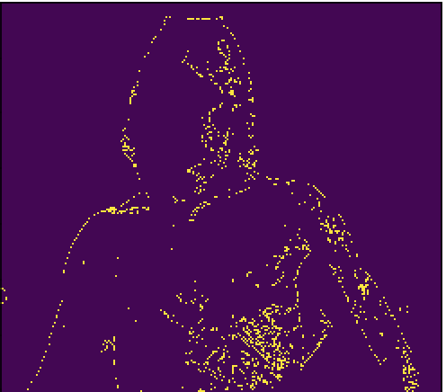
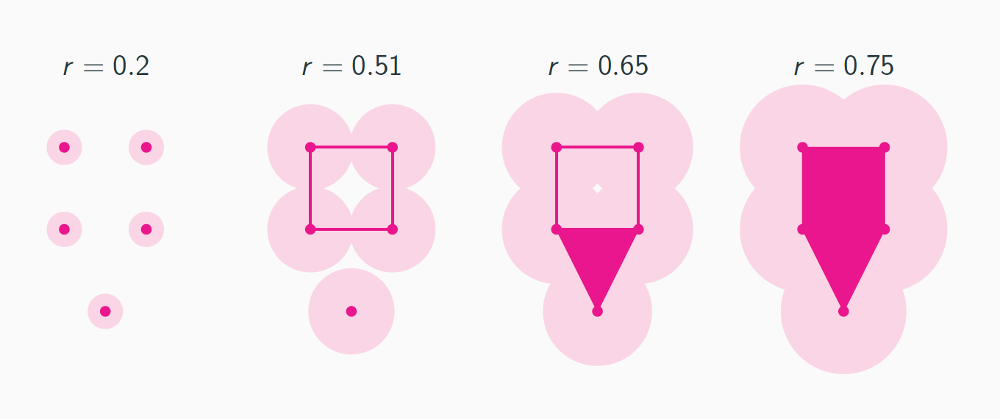
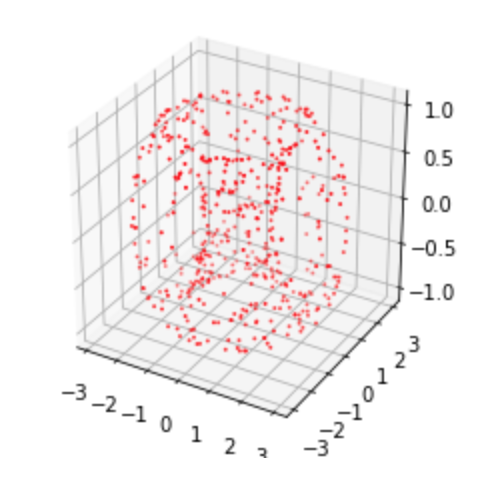
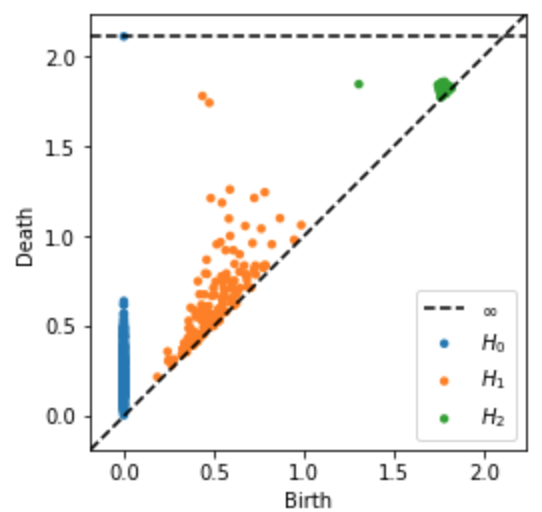

## Topological Data Analysis in Python (SMTB 2019)

These are the materials, including slides and jupyter notebooks of the course I taught at the School of Molecular and Theoretical Biology the summer of 2019, in Barcelona, on Topological Data Analysis in Python.

### The Shape of Data

What information can we obtain from the shape of point cloud data? Topological data analysis methods provide an answer to this question. Some of the tools used include clustering, dimensionality reduction and persistent homology. In many situations, these techniques can outperform other more commonly used techniques like PCA. 

  
   

### Topological complex

A topological space can be associated to a point cloud data via methods like the Vietoris-Rips complex. It can be thought as an approximation of the data by a lower dimensional manifold with (maybe) non-trivial topology

  

### Barcodes and Betti Numbers

The Betti Numbers of a space give essential information about its topology. Persistent homology looks at how these numbers change when changing the parameters in the construction above. Below is a random sampling with noise of points on a two-dimensional torus. Its Betty numbers, $b_0=1$, $b_1=2$ and $b_2=1$ are recovered by the points far from the diagonal, i.e. the longer persisting cycles. 

  
   

